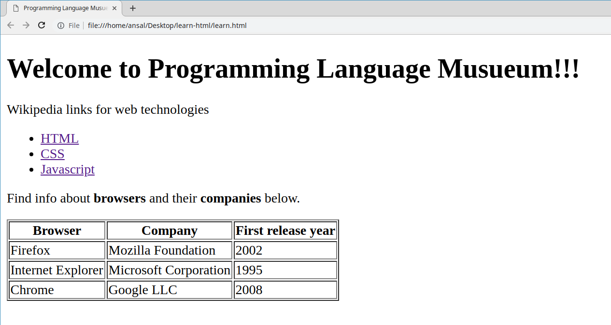
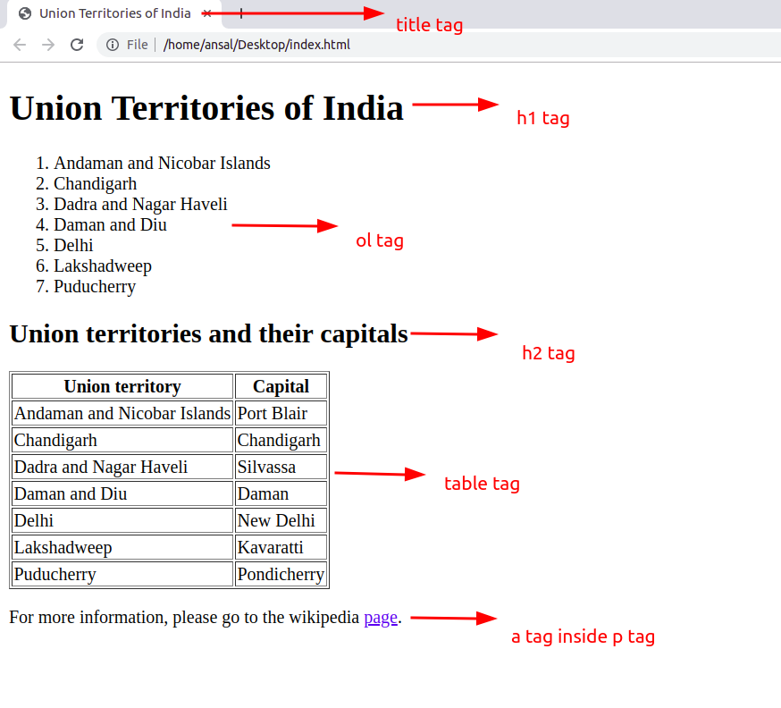

# List of Assignments

## Week 1

### Day 3: Git commit and push

Remember to change your default branch to `dev` before proceeding.

1. Create a folder named `day03` inside `week01`.
2. Create a file named `why_i_want_to_be_a_programmer.txt` inside the `day03` folder.
3. Write a short note in the file on why you want to be a programmer.
4. Commit the final changes and push to your repository.

> Solution session: _day-0_
>
> Due day: _day-0_

### Day 4: Creating an HTML page

1. Create a folder named `day04` inside `week01`.
2. Create a file named `programming-language-museum.html` inside the `day04` folder.
3. Write appropriate html code to achieve a page which looks like the image below.

> Solution session: _day-1_
>
> Due day: _day-1_
### Weekly Test: Create an html document which looks like the provided image

1. You have to use the exact tags as mentioned in the screenshot below.
2. Put your files under `assignments` > `week01` > `weekly-test`.

> Due day: _day-3_
----------
## Week 2

### Day 1: Create a webpage about yourself

1. Create a page about you with `html` and `css` having:
    1. A heading with your name.
    2. A short paragraph about you.
    3. A list of your favourite movies.
2. Put your files under `assignments` > `week02` > `day01`.

> Solution session: _day-0_
>
### Day 2: Create a webmail page

1. Create a webmail page which has three sections:
    1. The left one is for navigation and contains links for Inbox, Sent, Drafts & Trash. You can use an un-ordered list to do that.
    2. The right box is a table of emails with coloumns for From, Subject & Date.
    3. The bottom one is for placing ads.
2. You can use sizes, colors, fonts, etc according to your choice.
3. Put your files under `assignments` > `week02` > `day02`.

> Solution session: _day-0_
>
> Due day: _day-0_
----------
## Week 3
### Day 1: Create a company web page using Bootstrap 4

Home page

About Us page

Contact Us page

1. Do not use any custom css styles.
2. Use Bootstrap grid (rows and columns).
3. You are free to replace text content.
4. Put your files under `assignments` > `week03` > `day01`.

> Solution session: _day-0_
>
> Due day: _day-0_

## Week 04 

### Day 2
Write a Javascript program that prints even numbers from 1 to 100 in descending order
The output should show:

100
98
96
.
.
.
2

### Day 3
Write a Javascript program that prints multiplication table of 5 upto 10.
The output should show:
1 * 5 = 5
2 * 5 = 10
.
.
.
10 * 5 = 50

### Day 4
Write a Javascript function that takes an array and a value and search that value in the array.
Function should take two arguments - an array and a value to search inside the array.
If the element is found, the function should return the position of the element in an array.
If the element is not found, the function should return "-1".

### Day 5
1. create 2 div elements one having id root and another having class green-white and have some text inside.
2. create 2 p tags one having no attributes to it and another having class green-white and have some text inside.
i) change the text colour of the id root to red
ii) for the class green-white set the css properties as background colour green and text colour white.
iii) for p tag which doesn't have any attributes, change the font size to 20px;

### Weekly Test - Week 04 
var students = [
    {name: "Divyam", age: 29},
    {name: "Ansal", age: 28},
    {name: "Arkesh", age: 27},
    {name: "Gopi", age: 27},
    {name: "Nishant", age: 23},
    {name: "Rabeen", age: 30},
    {name: "Ruhan", age: 20},
    {name: "Sadab", age: 21},
];
1) Write a function called `filterObjects` which will return array of objects who's age is less than or equal to 25
    -> No loops, use only predefined functions 
2) Write a function called `addEmail` to add a new property to each of the object saying email = `name@gmail.com` replace the name with the original name from the object
    -> Again no loops, use only predefined functions 
3) Write a function called `sortObjects` to sort the objects by age (Descending Order)
    -> Use predefined function 
4) Write a function called addStudent
    -> Add your details to the array at index 2 
5) Write a function called `printTriangle` which will accept a number n, print triangular pattern
    *
    * * 
    * * *
    * * * *
    * * * * *
    * * * * * *
    * * * * * * *

## Week 05 

### Day 01
assignments/images/stack-week05-day01
assignments/images/login-week05-day01
assignments/images/calculator-week05-day01

### Day 05
1. The application should load a random question from the `https://api.myjson.com/bins/11gmhm`. Hint - You can use var randomNumber = Math.floor( Math.random() * 10 ) to get a random number which can be used as an index for the question array.
2. Once the user types an answer in the textbox and clicks Submit, the app should check whether the answer is correct or not. Show a dialog window (prompt) depending up on the right/wrong answer.
3. Also, once the page is loaded, a timer should be started from 30 seconds and go down till 0 second. Once the timer reaches 0, the user should be shown a message saying that Time is over! and he/she should not be able to submit an answer after that.
4. For styling and layout, please use Bootstrap.

## Week 06

### Day 01 
Use the below Ajax syntax to load the data of the cities (cities.json)
$.ajax({
                url: "https://api.jsonbin.io/b/5ddb7fe5040d843991f8a4e5",
                headers: {"secret-key": "$2b$10$u3A2D8i3xZI9s1Bq/YihAuje8T/nq4C0ulejX8TgqV2OCY1rijESi"},
                success: function(response){
                    console.log("done");
                }
            });
Create a Javascript program that searches cities of a state using AJAX. Then loop through the data to find the cities that belong to a state passed to the search function.

### Day 02 

images/book_search_week06

### Day 04 
Create an Express application with the following features -
An express application with four routes that perform addition, subtraction, multiplication and division.
The add route should take two url parameters and send back their sum.
The sub route should take two url parameters and send back their difference.
The mul route should take two url parameters and send back their product.
The div route should take two url parameters and send back their division result.

### Day 05 
# ExpressJS CRUD

Create an EXpressJS application that has routes for creating, adding, updating and deleting a person's contact information - Maintain the data in a JS array 

Each entry should be maintained with below format 
{
    name: "Name",
    phone: "phone-no"
}