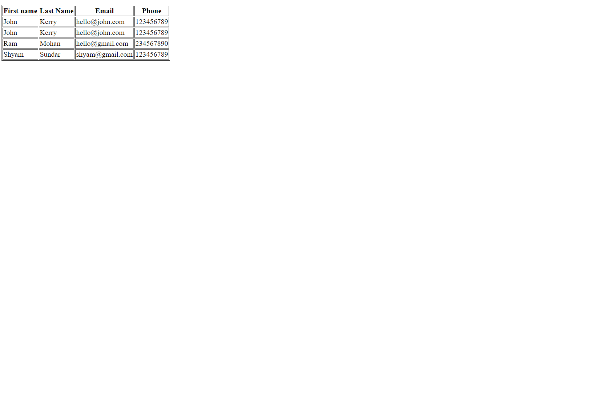

# List of Assignments

## Week 1

### Day 3: Git commit and push

Remember to change your default branch to `dev` before proceeding.

1. Create a folder named `day03` inside `week01`.
2. Create a file named `why_i_want_to_be_a_programmer.txt` inside the `day03` folder.
3. Write a short note in the file on why you want to be a programmer.
4. Commit the final changes and push to your repository.

> Solution session: _day-0_
>
> Due day: _day-0_

### Day 4: Creating an HTML page

1. Create a folder named `day04` inside `week01`.
2. Create a file named `programming-language-museum.html` inside the `day04` folder.
3. Write appropriate html code to achieve a page which looks like the image below.


> Solution session: _day-1_
>
> Due day: _day-1_
### Weekly Test: Create an html document which looks like the provided image


1. You have to use the exact tags as mentioned in the screenshot below.
2. Put your files under `assignments` > `week01` > `weekly-test`.


> Due day: _day-3_
----------
## Week 2

### Day 1: Create a webpage about yourself

1. Create a page about you with `html` and `css` having:
    1. A heading with your name.
    2. A short paragraph about you.
    3. A list of your favourite movies.
2. Put your files under `assignments` > `week02` > `day01`.

> Solution session: _day-0_
>
### Day 2: Create a webmail page


1. Create a webmail page which has three sections:
    1. The left one is for navigation and contains links for Inbox, Sent, Drafts & Trash. You can use an un-ordered list to do that.
    2. The right box is a table of emails with coloumns for From, Subject & Date.
    3. The bottom one is for placing ads.
2. You can use sizes, colors, fonts, etc according to your choice.
3. Put your files under `assignments` > `week02` > `day02`.

> Solution session: _day-0_
>
> Due day: _day-0_
----------
## Week 3
### Day 1: Create a company web page using Bootstrap 4

Home page

About Us page

Contact Us page


1. Do not use any custom css styles.
2. Use Bootstrap grid (rows and columns).
3. You are free to replace text content.
4. Put your files under `assignments` > `week03` > `day01`.

> Solution session: _day-0_
>
> Due day: _day-0_


### Day 4: Even numbers in descending order

1. Write program in Javascript that displays even numbers in descending order.
2. Start from `100` and end at `2`.
3. Sample output:
```
100
98
96
.
.
.
2
```
4. No HTML or CSS required.
5. Put your file under `assignments` > `week03` > `day04`.

> Solution session: _day-0_
>
> Due day: _day-0_

### Day 5: Print multiplication tables

Write a Javascript program that prints multiplication table of 5 from 1 to 10.
```
5 * 1 = 5
5 * 2 = 10
.
.
.
5 * 10 = 50
```
4. No HTML or CSS required.
5. Put your files under `assignments` > `week03` > `day05`.

> Solution session: _day-0_
>
> Due day: _day-0_

## Week 4

### Day 01:Write a Javascript function that takes an array and a value and search that value in the array.

1. Function should take two arguments - an array and a value to search inside the array.
2. If the element is found, the function should return the position of the element in an array.
3. If the element is not found, the function should return "-1".

### Day 02: Create a HTML page with a button that should alert a message when it is clicked

1. Use JS event handler for receiving the click event

### Day 03: Create a simple calculator using JS with the UI looking like this -

1. Use inputs of type number.
2. Use functions as and when necessary.
3. Put your files under assignments > week04 > day03.

## Week 5
### Day 02: Making all tds of a table change color when mouseover and return to original on mouseout using jquery

1. Create a table with 4 columns with header elements and 4 rows using append / prepend.
2. Handle the mouseout/ mouseover events using eventlistener.
3. Change the color of the td to blue based on mouseover and return it back to it's original color on mouseout.
4. Put your files under assignments > week05 > day02.


## Week 5 
### Day 03: The Quiz application in jQuery

The original description of the assignment - 


1. The application should load a random question from the https://api.jsonbin.io/b/5dc2a6f7ce068a7724676fa9 api. Hint - You can use `var randomNumber = Math.floor( Math.random() * 10 )` to get a random number which can be used as an index for the question array.
2. Once the user types an answer in the textbox and clicks Submit, the app should check whether the answer is correct or not. Show a dialog window (prompt) depening up on the right/wrong answer. 
3. Also, once the page is loaded, a timer should be started from 30 seconds and go down till 0 second. Once the timer reaches 0, the user should be shown a message saying that `Time is over!` and he/she should not be able to submit an answer after that.
4. For styling and layout, please use Bootstrap.
