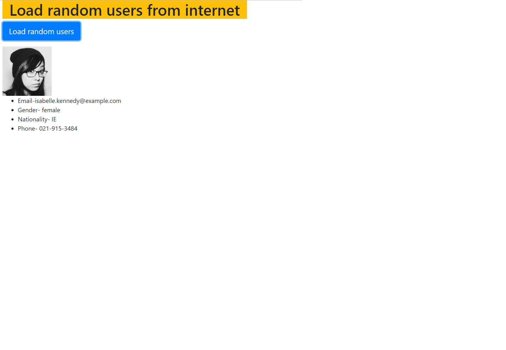

# Coding challenge description

## Day 04 Week 03
### Write a Javascript program that prints odd numbers from 1 to 100 in descending order.


1. Start from `99` and end at `1`.
2. Sample output:
```
99
97
95
.
.
.
1
```
## Day 05 Week 03

### Write a Javascript program that compares two arrays and print whether they are equal or not.

**Note:** Two arrays are considered equal if both arrays contain the same number of elements, and all corresponding pairs of elements in the two arrays are equal. In other words, two arrays are equal if they contain the same elements in the same order. 


### Write a program to take a string as input and change each letter to the next letter in the alphabet.


```
Input: "hello"
Output: "ifmmp"

Input: "zeta"
Output: "afub"
```
## Day 01 Week 04

#### Star Pattern using Javascript

Write a Javascript function that produces a star pattern likes this.

```
*
**
***
****
*****
****
***
**
*
```

## Day 02 Week 04

#### Multile Javascript File Linking


Create three Javascript files - 

1. `even.js` containing `evenFunction()` that returns if a number is even or not.

2. `odd.js` containing `oddFunction()` that returns if a number is odd or not.

3. `square.js` containing `squareFunction()` that returns if a number is square or not.

And now create a `main.js` file that calls all these functions with sample input and `console.log` their outputs.

## Day 03 Week 04
### Create a Javascript app that emulates "Stack" behavior.

1. Push button should add value in the textbox to stack.
2. Pop button should remove the last element added to stack.
3. There should be validation for push button. Empty values should not be added to stack.
4. Array can be used as a stack along with push() and pop() methods.
5. During each operation, the stack display area should show the current stack contents.

## Day 03 Week 05
### Create a webpage to load random users from internet.


1. The api to fetch random users is https://randomuser.me/api/.
2. Fetch data from here using ajax and display it on the page as shown in the image.
3. The user shown in the image may be different but the design should be same.
4. Use bootstrap to design the page.
