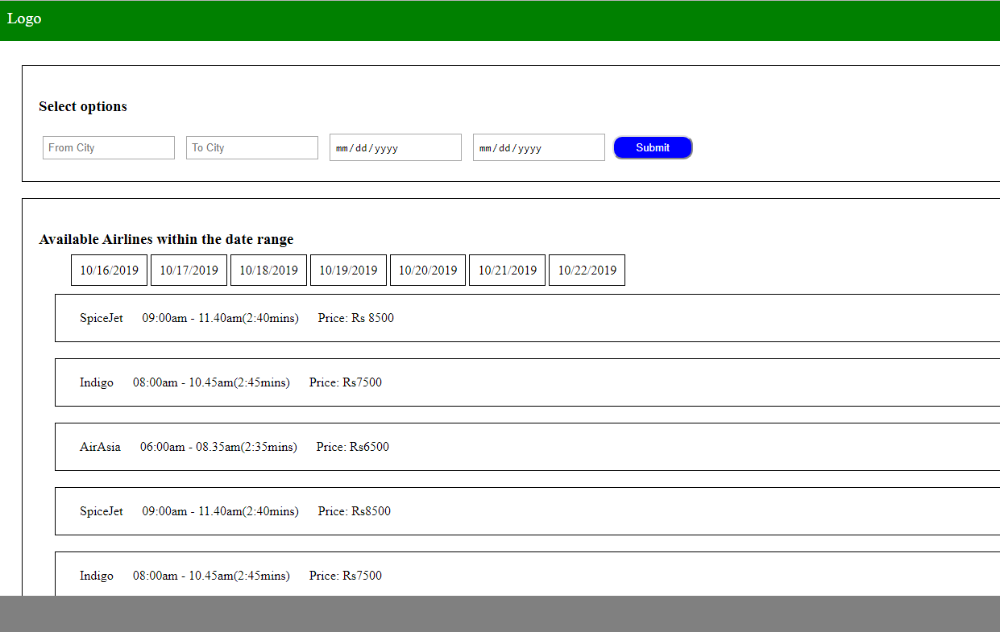
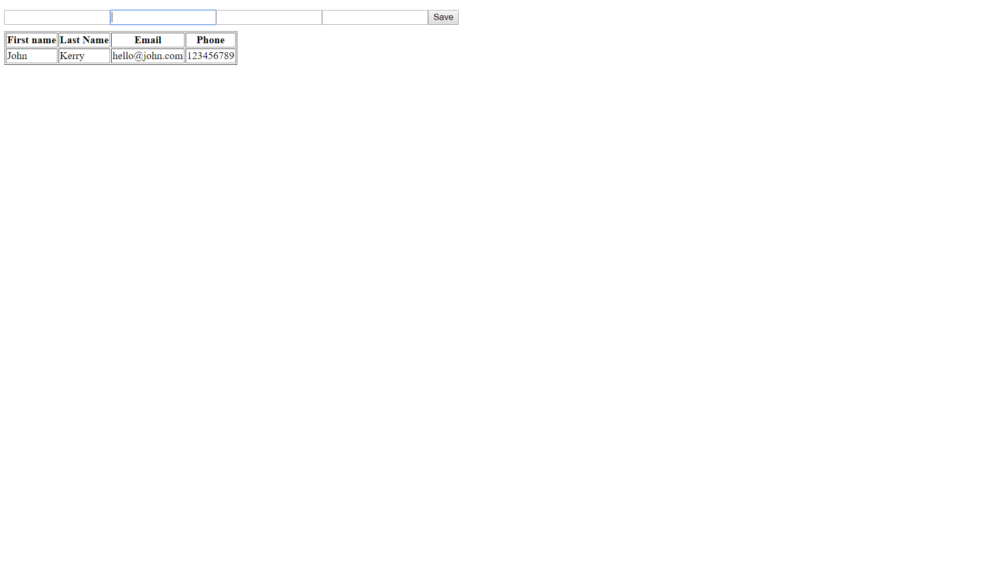

# Weekly test - week 2 description

1. Fixed header with LOGO text at the left
2. A search box with a header text, 4 input fields and a button. Last 2 input fields should allow the user to select dates from calender.
3. The result box with a header text, all the dates within the date range they have selected and the search results.

4. There should be at least 7 search results along with details as mentioned below.

5. airline name, fromtime-totime(total time), price and a button book now floating to the right.

6. The button design should be as shown in the image. 

7. Fixed Footer at the bottom

8. Upload this assignment in the week 2 / weekly-test folder 

# Weekly test - week 4 description

1. Create 4 inputs for firstname,lastname, email and phone
2. Create a button and listen for onclick to fetch the values from the text boxes
3. Create a function to store the values in an array 
4. Create a table with headers as firstname,lastname,email and phone
5. Create another function to append a new row dynamically to the table when a new set of values are saved from the front end
